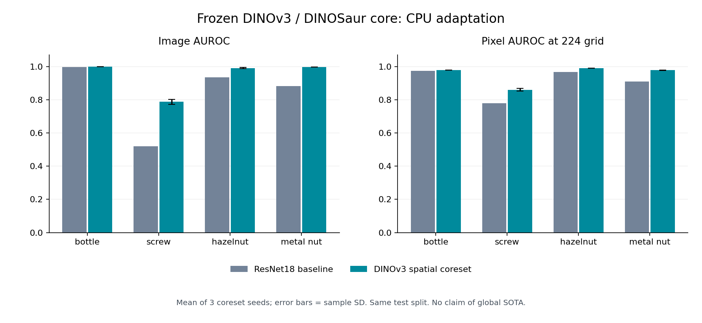
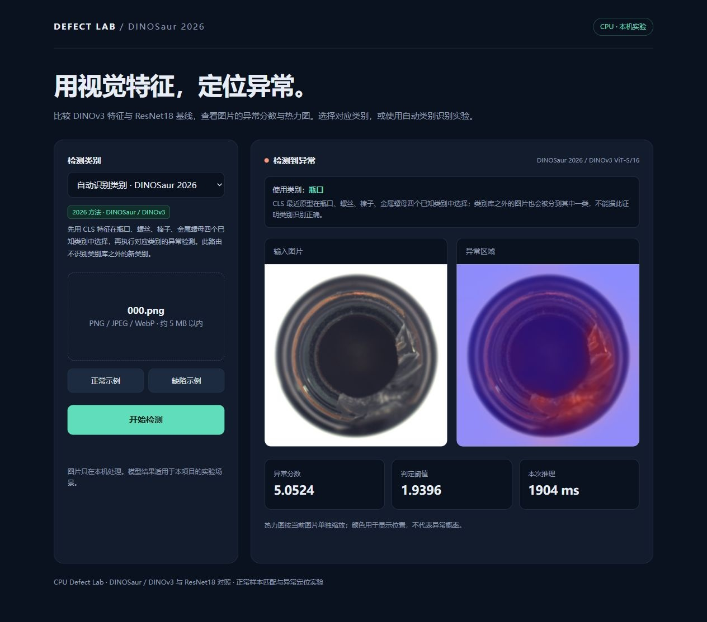

# CPU Defect Lab：DINOSaur / DINOv3 工业异常检测

面向计算机视觉／算法工程师求职的论文核心方法复现项目。以 [DINOSaur（ECCV 2026）](https://arxiv.org/abs/2605.24251v2) 为依据，用冻结 DINOv3、逐位置 coreset 特征库和邻域限制检索完成工业缺陷检测与定位，保留旧 ResNet18 方法作对照。项目重点是本机 CPU 适配、控制变量消融、采样稳定性、类别增量路由和真实失败分析。

本机为 Intel i5-1130G7、约 16 GB 内存，无 NVIDIA 显卡。新版使用 CPU float32、1 计算线程、特征提取 batch=2；只建立正常样本特征库，不训练或微调视觉骨干。

[项目复盘：做了什么、怎么做、遇到的问题与解决办法](reports/PROJECT_STORY.md) 按真实源码和实验记录说明完整过程，包括 CPU 资源约束、空间检索、数值误差、数据隔离、工程验证及仍未解决的失败情况。

## 螺丝漏检改进实验

在原正常训练图中固定划分 192 张建库、48 张开发、16 张合成审计，保留原 64 张正常图校准阈值。仅用开发源图的三种合成代理缺陷，比较 224 输入、336 输入、姿态对齐和多尺度；按预先固定规则选中 **336 输入／半径 4**，再评估已经看过的真实测试集。此复测属于探索性证据。实际选中方案没有使用姿态对齐或多尺度。

| 螺丝方法 | 建库图 | 图像 AUROC | 检出／119 个缺陷 | 漏检 | 误报／41 个正常 |
|---|---:|---:|---:|---:|---:|
| 原发布 DINOv3，224，固定 seed 42（历史） | 256 | 0.7963 | 60 | 59 | 5 |
| 本轮相同划分的 224 对照 | 192 | 0.7807 | 42 | 77 | 5 |
| 开发集选定的 336 方案 | 192 | **0.8215** | **82** | **37** | **6** |

主比较是本轮相同 192 图来源的 224 与 336 方案；原 256 图模型仅作历史比较。新版检出比例为 68.91%，仍有 37 个漏检，误报也多了 1 张。336 的邻域半径从 3 调为 4 以近似保持相对范围，因此比较的是两个预定流程，不把提升全部归因于分辨率。新模型是一次固定 seed 42 实验，不与下方历史三种子均值混用。

详见 [螺丝改进报告](reports/SCREW_REFINEMENT.md)、[实验协议](SCREW_REFINEMENT_PROTOCOL.md)与[验收记录](reports/SCREW_REFINEMENT_QA.json)。网页新增“螺丝 · 开发集选择方案”，保留默认瓶口模型和原四类自动路由。运行 `reproduce_screw_refinement.ps1` 可在初始项目复现后重做本轮；新图命令行为 `python screw_refine_predict.py --image photo.png --output-dir prediction`。冻结源码按字节校验，`.gitattributes` 保留这些源文件的换行字节。

57 项单元测试通过；真实 Engine、CLI 与 HTTP 输出和离线分数一致。另用实际浏览器检查正常、划痕和已知漏检样本，详见[网页操作记录](reports/SCREW_REFINEMENT_BROWSER_QA.json)。截图为真实上传 `scratch_head/000.png` 的输出；耗时受本机后台负载影响，不能据此作公平速度比较。


## 正式实验结果

<!-- FRONTIER_RESULTS_START -->

四类别共 **24 次正式运行**已完成：主方法每类 3 个 coreset seeds，三组消融每类各 1 个 seed。下表直接取自完整证据与逐次记录；旧版为固定 seed 42 的 ResNet18 局部特征基线。

| 类别 | 测试图数 | ResNet18 图像 AUROC | DINOSaur 图像 AUROC（均值±标准差） | DINOSaur 像素 AUROC（均值±标准差，224 网格） | 发布 seed 42 漏检／异常数 | 发布 seed 42 误报／正常数 |
|---|---:|---:|---:|---:|---:|---:|
| bottle（瓶口） | 83 | 0.9976 | 1.0000 ± 0.0000 | 0.9785 ± 0.0001 | 0/63 | 0/20 |
| screw（螺丝） | 160 | 0.5190 | 0.7870 ± 0.0148 | 0.8603 ± 0.0078 | **59/119** | **5/41** |
| hazelnut（榛子） | 110 | 0.9350 | 0.9910 ± 0.0033 | 0.9903 ± 0.0003 | 5/70 | 1/40 |
| metal_nut（金属螺母） | 115 | 0.8827 | 0.9966 ± 0.0005 | 0.9775 ± 0.0004 | 1/93 | 2/22 |

四类的图像排序指标均高于旧版。螺丝仍是明显不足：发布模型只检出 60/119 个异常，召回率 50.42%、F1 0.6522，不能把 AUROC 的提升写成检出问题已解决。瓶口本次测试全部判对也只适用于这 83 张固定测试图，项目仍是研究实验与演示。

<!-- FRONTIER_RESULTS_END -->

结果表中的新方法是固定主方案 `spatial_kcenter_r3`，报告 coreset seeds 42、43、44 的均值与样本标准差。三次运行使用同一训练／校准／测试划分，标准差描述随机建库稳定性，不能当作独立测试集上的置信区间。发布到演示和 CLI 的模型固定使用 seed 42，不按测试成绩选择最佳种子。

完整指标、固定阈值的漏检／误报和消融见 [新版实验报告](reports/FRONTIER.md)，逐次配置及预测记录见 [机器可读证据](reports/frontier/evidence.json)。瓶口、螺丝测试集已在旧版查看过；榛子、金属螺母在本轮协议冻结前未评估。各类别的结果均保留。

旧版与新版的骨干、库构成和特征维度均不同，跨方法表是整套流程的比较。解释各组件作用时，应看 DINOv3 内部的同预算采样与检索消融，不能将全部变化归因于某一个组件。



## 在本机使用

双击 `start_demo.cmd`，等待 `Demo ready` 后打开 <http://127.0.0.1:18765/>。服务已运行时直接访问该地址。新版选项包含瓶口、螺丝、榛子、金属螺母四个类别和“自动识别类别”；另保留瓶口、螺丝两个 ResNet18 基线选项。可使用正常／缺陷示例，或上传 PNG、JPEG、WebP 图片。

自动模式先用 CLS 特征与四类正常原型的欧式距离选择类别，再使用该类别的特征库与校准阈值。它只在这四个已知类别中选择，类别库之外的图片也会被分到其中一类。使用类别是否正确、异常判断是否正确是两项独立检查。

上传图片只在本机内存处理。网页展示输入、异常热力图、分数、阈值、实际使用类别与预处理＋前向＋评分时间；该时间不包含网络传输或图片绘制。分数不是概率，热力图颜色在每张图片内单独缩放。



命令行使用与网页相同的发布模型和推理引擎：

```powershell
.\.venv\Scripts\python.exe frontier_predict.py --model dinov3-bottle --image data\mvtec\bottle\test\broken_small\000.png --output-dir reports\frontier\cli-example
.\.venv\Scripts\python.exe frontier_predict.py --model dinov3-auto --image data\mvtec\screw\test\good\000.png --output-dir reports\frontier\cli-auto
```

`--output-dir` 可省略；提供时输出 `original.png`、`heatmap.png`、`prediction.json`。其他模型 ID 为 `dinov3-screw`、`dinov3-hazelnut`、`dinov3-metal_nut`。

## 核心实现与实验设计

RGB 图片以张量双线性 resize 到 224×224，启用 antialias，再转 float32、使用 ImageNet 归一化。冻结的 DINOv3 ViT-S/16 输出最终 LayerNorm 的 384 维 CLS 与 14×14×384 patch 特征；移除 CLS 和四个 register token，不另作 L2 归一化。timm 的 RoPE periods 按模型卡进行 bf16→float32 截断，详细适配说明见 [实验协议](FRONTIER_PROTOCOL.md)。

正常训练图以 split seed 42 分成 80% 建库、20% 互斥校准。每个空间位置独立用 greedy k-center 选正常特征，库大小为 `min(N, max(20, floor(0.1*N)))`，其中 N 是建库图片数。主方案在半径 3 的有效邻域内找最近特征，以最大 patch 距离作为图像分数，插值输出 224 网格热力图。阈值取保留正常校准分数的 95% 分位，测试缺陷标签只用于评估。

| 方案 | 特征库采样 | 检索约束 | coreset seeds | 检查目的 |
|---|---|---|---|---|
| 主方法 `spatial_kcenter_r3` | 逐位置 k-center | 半径 3 | 42、43、44 | 固定主方案与采样稳定性 |
| `spatial_random_r3` | 逐位置随机，同预算 | 半径 3 | 42 | coreset 采样消融 |
| `unrestricted_kcenter` | 与主方法相同的 k-center 库 | 全局 | 42 | 空间约束消融 |
| `spatial_kcenter_r0` | 与主方法相同的 k-center 库 | 同一位置 | 42 | 邻域消融 |

消融每组只有 seed 42，不能报告它们的多种子稳定性。主方案和参数在正式测试前固定；三类消融用于解释检索设计，没有用测试成绩改选发布方法。

类别增量按 bottle → screw → hazelnut → metal_nut 顺序加入正常库与 CLS 原型。已有库保留，用 SHA256 检查内容是否改变；每一阶段重新检查已知类别的路由和异常判断。新增原型可能改变旧图片的路由，因此库内容不变不能直接证明整个系统零遗忘。阶段表、实际路由准确率和首次／最后阶段变化在新版报告中完整保留。

本次四阶段记录中已有库的内容哈希均保持不变。第四阶段四类共 468 张测试图的 CLS 路由正确率为 100%，已有类别的本次自动路由指标没有下降。这是固定 seed 42、固定加入顺序和四个已知类别的观测，不能保证未知产品、持续漂移或任意新任务上的类别识别与零遗忘。

## 复现范围与资源记录

这份实现使用 timm 接口、224 输入、95% held-out 正常阈值和四个 MVTec AD 类别，是论文核心方法的 CPU 适配。它没有覆盖原论文全部类别、97.5% 训练分位阈值、连续漂移、逻辑异常和边缘 GPU benchmark，也不宣称与 Meta 原运行库逐位一致。DINOSaur 与 DINOv3 来自原作者，项目贡献属于适配、可复现评估和工程验证。

新主方法固定 1 计算线程；已有基线记录包含 4 线程运行，各类别和运行时负载也有差别。方法准确率可按相同数据划分比较，历史耗时不能据此作公平速度排名。[资源检查](reports/frontier/RESOURCE_PROFILE.md) 记录了选择线程数和分块策略的依据及计时限制。

像素 AUROC 在本项目 224×224 网格计算，不是 MVTec 原图分辨率的官方定位评测。缓存评分耗时不包含特征提取；特征库字节数和差分张量预算也不等于进程峰值内存。正常校准样本有限，95% 分位阈值不保证测试误报率恰好为 5%。模型只对建库样本覆盖的工业场景建模，普通网络照片的角度、背景和尺度可能不同；逐图测试保留这些场景差异和失败输出。

## 从源码复现（Windows PowerShell）

需要 Python 3.10–3.12 和下载依赖、数据、权重的网络连接。解压源码包，进入项目目录；在新环境先运行安装，再运行完整复现脚本：

```powershell
.\setup.ps1
.\reproduce_frontier.ps1
.\start_demo.cmd
```

`setup.ps1` 安装 CPU PyTorch、torchvision 和绘图库。`reproduce_frontier.ps1` 先完成旧版实验历史，再安装 `requirements-frontier.txt` 中的 timm、safetensors、huggingface-hub 及小型运行依赖，下载和校验 DINOv3 权重与四类数据，补充新类别基线，执行主方案、消融和类别增量实验，生成报告、发布模型、自动验收和源码包。它不再次安装 CUDA 或替换大模型依赖；中断后的已验证下载和特征缓存可复用。CPU 总耗时取决于本机负载和网络，浏览器操作与截图需要单独验收。

本机已装好的环境借用现有 CPU PyTorch，不需再执行 `setup.ps1`。本次准确基础版本见 `requirements-local.txt`，新增包固定于 `requirements-frontier.txt`。

权重使用公开 [timm DINOv3 ViT-S/16 模型卡](https://huggingface.co/timm/vit_small_patch16_dinov3.lvd1689m)，固定 revision `3bf4720a82ec2066db88137180ff1f83a675cef0`。文件大小为 86,362,376 bytes（约 86.4 MB / 82.4 MiB），SHA256 为：

```text
2a1ec16ae28ffa07bc0ead0241ee7df9fc26451fe6f9f839b7b3afa0a906b040
```

`frontier_setup.py` 完整核验大小和哈希后才接受文件，下载 provenance 写入 `cache/frontier/backbone_provenance.json`，并保留在新版证据文件中。发布 bank 也逐个校验固定配置与 SHA256。原始数据使用 `foersben/mvtec-ad` 公开镜像，固定 revision、核对大小与可用 LFS 哈希，并记录逐文件 SHA256；没有声称镜像与官方归档逐字节一致。

## 交付与证据

- [新版实验报告](reports/FRONTIER.md)：四类别对照、三种消融、多种子统计、类别增量和失败图。
- [新版简历与面试材料](reports/FRONTIER_INTERVIEW.md)：方法出处、实际贡献、指标含义与局限。
- [自动验收](reports/FRONTIER_QA.json)、[真实浏览器验收](reports/FRONTIER_BROWSER_QA.json)：算法／API／离线在线一致性和真实页面操作分别记录。
- [新版逐图试验](reports/FRONTIER_IMAGE_TRIALS.md)：固定图片列表的分数、类别、判断和热力图；[JSON 记录](reports/FRONTIER_IMAGE_TRIALS.json) 保留机器可读结果。
- [运行证据](reports/frontier/evidence.json)、`reports/frontier/run_records/`：每次正式运行的配置、逐图 CSV、汇总与文件哈希。
- `frontier.py`、`frontier_core.py`：骨干特征、逐位置 coreset、分块检索和 CLS 路由；`frontier_predict.py`：新图片推理。
- `demo_server.py`、`static/index.html`：本机演示；`release/frontier/`：固定 seed 42 发布库；`outputs/frontier/`：原始实验产物。
- GitHub 仓库可通过 **Code → Download ZIP** 下载源码、报告、配置／预测表和图；不包含 `.venv`、原始数据、特征缓存、骨干权重或发布 bank，使用前按上述步骤复现。也可执行 `python -c "from finalize import source_archive; print(source_archive())"` 生成本地 `delivery/cpu-defect-lab-source.zip`。

旧版内容保存在 [BASELINE_README](reports/BASELINE_README.md)，历史实验见 [旧版最终报告](reports/FINAL.md)、[旧版逐图试验](reports/IMAGE_TRIALS.md)。历史文档保留旧版内容与数字，链接已按存档位置调整。

## 原始参考与许可

- [DINOSaur 论文 v2，ECCV 2026](https://arxiv.org/abs/2605.24251v2)，以及 [官方方法仓库固定 commit](https://github.com/Continue-Edge-AI-Lab/Rethinking-Continual-AD/tree/9574f14f2e5a99e605ed19f0ff78f0a496d29252)。
- [Meta DINOv3 仓库](https://github.com/facebookresearch/dinov3) 与 [DINOv3 论文](https://arxiv.org/abs/2508.10104)。
- [timm 模型卡](https://huggingface.co/timm/vit_small_patch16_dinov3.lvd1689m)，[固定权重 revision](https://huggingface.co/timm/vit_small_patch16_dinov3.lvd1689m/tree/3bf4720a82ec2066db88137180ff1f83a675cef0)；运行库 timm 1.0.30，对应 [commit](https://github.com/huggingface/pytorch-image-models/tree/0df212b369a5385b16dfe513d5143a7311ea1ddc)。
- [MVTec AD 官方数据集](https://www.mvtec.com/research-teaching/datasets/mvtec-ad)，[PatchCore 论文](https://arxiv.org/abs/2106.08265) 提供旧版局部正常匹配思路。

DINOv3 权重遵循自定义 **DINOv3 License**，详见 [权重仓库许可证](https://huggingface.co/timm/vit_small_patch16_dinov3.lvd1689m/blob/3bf4720a82ec2066db88137180ff1f83a675cef0/LICENSE.md) 和 [Meta 官方许可证](https://github.com/facebookresearch/dinov3/blob/main/LICENSE.md)，不能将权重许可写成 MIT 或 Apache。MVTec AD 原图及本项目来源于它的可视化注明来源 MVTec AD，遵循 **CC BY-NC-SA 4.0**。源码包不附原始数据或预训练权重。

本项目自编源码采用 [MIT License](LICENSE)。MVTec AD、Commons 图片及其衍生图、预训练权重使用各自许可；来源、许可范围和图片修改说明见 [第三方声明](THIRD_PARTY_NOTICES.md)。
