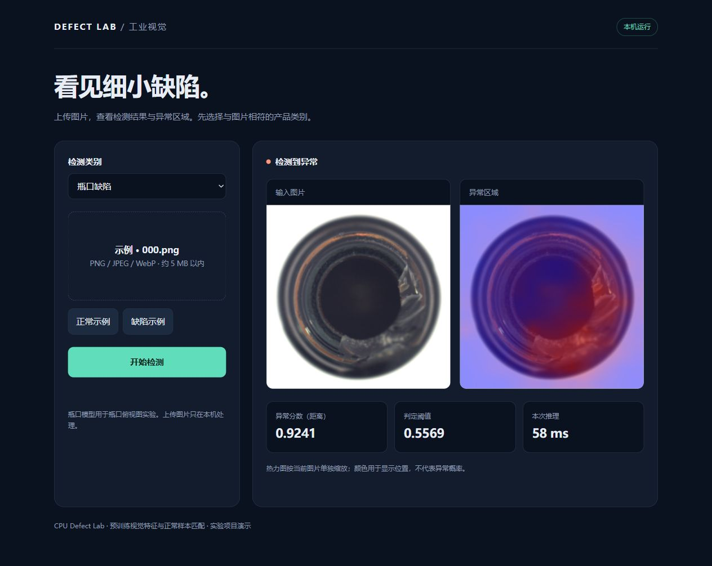

# CPU Defect Lab：本机工业视觉异常检测

面向计算机视觉／算法工程师求职的完整实验项目。使用冻结的 ResNet18 和正常样本最近邻特征库，在 CPU 上完成缺陷检测、定位、控制变量对比、训练侧参数选择、错误追溯与网页演示。代码独立编写，借鉴 PatchCore 思路，没有复制参考仓库或声称实现官方 PatchCore。

已在 Intel i5-1130G7、约 16 GB 内存、无 NVIDIA 显卡的本机跑完。默认 4 线程、batch=4；无需训练或微调深度网络。

## 实测结论

| 类别／方案 | 测试图数 | 图像 AUROC | 像素 AUROC（224 网格） | 漏检／异常总数 | 误报／正常总数 |
|---|---:|---:|---:|---:|---:|
| bottle 整图 layer4 | 83 | 0.9937 | — | 1/63 | 2/20 |
| bottle 同层整图 | 83 | 0.9698 | — | 2/63 | 2/20 |
| bottle 局部（默认演示） | 83 | **0.9976** | **0.9740** | 0/63 | 1/20 |
| screw 同层整图 | 160 | 0.6233 | — | 96/119 | 8/41 |
| screw 局部（研究对照） | 160 | **0.5190** | 0.7786 | 108/119 | 5/41 |

局部方法在 bottle 上有效，固定参数的跨类别检查在 screw 上失败。不能宣称普遍泛化或生产可用。保留失败结果及错误定位证据，是这个项目的研究部分。

完整结论见 [最终报告](FINAL.md)，简历条目与讲解见 [面试材料](INTERVIEW.md)，验收记录见 [QA](QA.json)。

另做了 10 张图片的实际检测：[逐图结果与热力图](IMAGE_TRIALS.md)，包含固定抽取的 8 张测试图和 2 张新下载的普通网图，保留误报、漏检和拍摄场景不匹配的输出。

## 立即演示（当前本机已经安装完成）

双击 `start_demo.cmd`，等待 `Demo ready`，打开 <http://127.0.0.1:18765>。如果已有服务运行，直接打开该地址。选择瓶口模型，点击正常／缺陷示例或上传 PNG、JPEG、WebP，然后开始检测。

图片在本机内存处理，不保存上传图片。界面显示原图、定位热力图、原始距离分数、正常校准阈值与本次推理时间。螺丝选项明确标记为效果不足的研究对照。



命令行检测：

```powershell
.\.venv\Scripts\python.exe predict.py --model release\bottle\model.pt --image data\mvtec\bottle\test\broken_small\000.png
```

## 方法与实验设计

- Global-NN：layer4 全局平均池化得到 512 维向量，归一化后检索正常整图特征。
- Local-NN：layer2、layer3 池化为 14×14 网格，拼接后固定种子选择通道，逐 patch 归一化并检索随机采样的正常库。最大 patch 距离作为图像分数，插值生成热力图。
- Global-Shared：使用与 Local 相同的层和通道，空间平均后归一化，用于同层／同维度比较。库构成与聚合方式仍不同，因此不是单因素因果证明。
- 缓存原始特征，用输入内容 SHA256 标识；最近邻按 128 个 query 分块计算。

首轮 bottle：209 张正常训练图按 seed=42 分为 167 张建库、42 张校准。阈值为正常校准分数的 95% 分位数；官方测试标签仅用于统计指标。首轮配置在运行前固定。

第三轮：将 42 张训练侧 held-out 正常图分成 21 张调参图和 21 张另留阈值图，使用调参图生成 21 个划痕／斑点合成样本。比较 32/64/128 维 × 500/2000/5000 库大小，共 9 组，以验证 AUROC 最大、同分库字节数最小选出 64/2000。合成 AUROC 为 0.9864；合成缺陷不是实际缺陷的替代。bottle 此时已经看过测试结果，复测属于探索性结果。

随后在 screw 首次测试前冻结参数，用该类别正常图重新建库和校准；这是超参数跨类别检查，不是零样本迁移。保留其负面结果，没有对 screw 测试集再调参。

协议与证据：[首轮](../EXPERIMENT_PROTOCOL.md)、[同层对比](../ROUND2_PROTOCOL.md)、[第三轮](../ROUND3_PROTOCOL.md)、[首轮报告](BASELINE.md)、[错误追溯](ROUND2.md)。

## 从源码复现（Windows PowerShell）

需要 Python 3.10–3.12，联网下载依赖、数据及权重。源码 ZIP 不含环境、原始数据或权重。解压后进入项目目录：

```powershell
.\setup.ps1
.\reproduce.ps1
.\start_demo.cmd
```

`reproduce.ps1` 顺序完成两个类别下载、三种表示的 bottle 实验、误报追溯、9 组训练侧验证、最终对照与 screw 检查、报告／发布模型、自动验收和源码打包。CPU 耗时取决于后台负载和网络。浏览器截图及交互记录属于本次人工验收证据，重新运行脚本不会自动重做浏览器操作。

本机已有环境采用 `--system-site-packages` 借用现有 CPU PyTorch，并仅在项目环境补装 torchvision；没有修改原环境。准确版本见 `requirements-local.txt`；新安装使用官方 PyTorch CPU 源。

数据下载默认使用 Hugging Face 公开镜像 `foersben/mvtec-ad`，固定 revision 并核对文件大小、可用 LFS 哈希，逐文件记录 SHA256。镜像未与官方归档逐字节核验。也支持官方 bottle 归档：

```powershell
.\.venv\Scripts\python.exe download_data.py --archive 'C:\path\bottle.tar.xz'
```

## 文件与指标说明

- `lab.py`、`metrics.py`：特征、建库、评分和指标；`predict.py`：新图片预测。
- `validation_study.py`：训练侧合成验证；`analyze_errors.py`：指定瓶口误报 patch 最近邻来源追溯。
- `demo_server.py`、`static/index.html`：本机演示；`tests/`、`verify_delivery.py`：单元和 HTTP 推理一致性检查。
- `outputs/`：每次实际实验的配置、逐图预测、指标、模型和热力图。
- `release/`：默认瓶口、螺丝对照及另留阈值的瓶口模型。
- `reports/`：报告、9 组验证表、图表、错误追溯、演示截图、验收记录和面试材料。
- `delivery/cpu-defect-lab-source.zip`：可分享源码包，包含报告和截图。

2,000×64 float32 特征库约 0.49 MiB，这是库张量大小，不是进程峰值内存。缓存评分时间不等于完整推理时间。网页记录预处理＋前向＋评分时间，不含请求传输和图像绘制。热力图逐图缩放，颜色不代表概率。像素 AUROC 在 224×224 网格计算，不是官方原图分辨率评测。校准样本有限，95% 分位阈值不保证测试误报率为 5%。

## 参考与许可

- [MVTec AD 官方数据集](https://www.mvtec.com/research-teaching/datasets/mvtec-ad)
- [torchvision ResNet18](https://docs.pytorch.org/vision/stable/models/generated/torchvision.models.resnet18.html)
- [Anomalib GitHub](https://github.com/open-edge-platform/anomalib)
- [PatchCore 论文](https://arxiv.org/abs/2106.08265)

MVTec AD 图片及来源于它的演示／研究图注明来源 MVTec AD，遵循数据集 CC BY-NC-SA 4.0 许可。仓库不打包原始数据或预训练权重。模型思路参考不意味着本项目实现论文的 coreset 或具备原创算法贡献。
