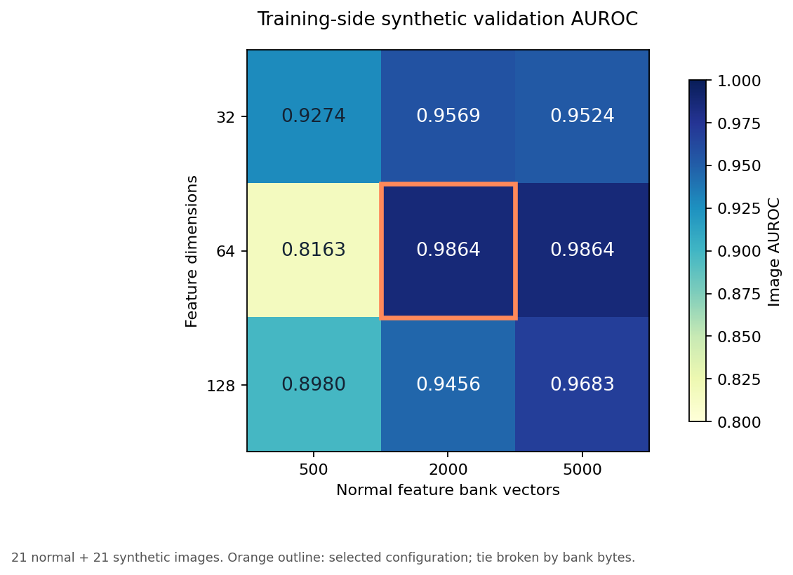

# 项目完整交付报告

项目实现 CPU 工业异常检测、缺陷定位、三种表示策略、训练侧合成验证参数选择、独立类别检查、单图命令行与本机网页演示。

## 训练侧验证与参数选择

167 张正常 bottle 图片建库；42 张 held-out 正常训练图进一步分为互斥的 21 张调参正常图与 21 张阈值校准图。21 个合成划痕／斑点样本来自调参正常图。官方测试图或标签不用于参数选择。

| 维度 | 库向量数 | 合成验证 AUROC | 库 MiB | 评分 median ms |
|---:|---:|---:|---:|---:|
| 32 | 500 | 0.9274 | 0.061 | 57.39 |
| 32 | 2000 | 0.9569 | 0.244 | 89.49 |
| 32 | 5000 | 0.9524 | 0.610 | 74.48 |
| 64 | 500 | 0.8163 | 0.122 | 11.97 |
| 64 | 2000 | 0.9864 | 0.488 | 17.55 |
| 64 | 5000 | 0.9864 | 1.221 | 57.63 |
| 128 | 500 | 0.8980 | 0.244 | 22.40 |
| 128 | 2000 | 0.9456 | 0.977 | 50.74 |
| 128 | 5000 | 0.9683 | 2.441 | 54.39 |

按预先固定的规则选择 **64 维、2000 个库向量**。合成验证 AUROC 为 0.9864；同分优先较小的库字节数。时间不参与选择。

合成缺陷与真实缺陷分布不同，合成指标不替代真实测试。

## 完整数据结果

| 实验 | 测试图片 | 图像 AUROC | 像素 AUROC（224 网格） | 漏检 | 误报 | 阈值校准图 |
|---|---:|---:|---:|---:|---:|---:|
| bottle 首轮固定配置／默认演示 | 83 | 0.9976 | 0.9740 | 0 | 1 | 42 |
| bottle 参数选择后／探索性复测 | 83 | 0.9976 | 0.9740 | 0 | 1 | 21 |
| screw 同层整图／首次评估 | 160 | 0.6233 | — | 96 | 8 | 64 |
| screw 局部／首次评估 | 160 | 0.5190 | 0.7786 | 108 | 5 | 64 |

screw 的参数在其首次测试前已由 bottle 训练侧验证冻结。模型使用 screw 正常训练图片重新建库和校准，这是超参数跨类别检查，不是无需建库的零样本迁移。

bottle 默认演示保留首轮固定配置与原 42 张正常校准阈值；参数选择后只使用另留的 21 张正常图片定阈值，作为独立对照保留。没有根据测试成绩替换默认模型。

**跨类别检查未成功：screw 局部图像 AUROC 为 0.5190，接近随机排序，且漏检 108/119 张异常图。瓶口上的较好成绩不能推广到螺丝。网页中的螺丝模型仅作为失败研究对照。**

## 演示与复现

运行根目录 start_demo.cmd，等待 Demo ready 后在本机浏览器打开 http://127.0.0.1:18765。选择产品类别，再上传图片或点正常／缺陷示例。
命令行、全流程复现、数据来源与许可证见 README.md；演示不需要云端服务。

## 证据与边界

- [首轮实验](BASELINE.md)
- [同层对比与误报追溯](ROUND2.md)
- [参数选择原始记录](selection.json)
- [最终实验协议](../ROUND3_PROTOCOL.md)
- [检查记录](QA.json)
- [面试材料](INTERVIEW.md)

局部特征库不是官方 PatchCore coreset。只检查两个类别；不能推广为完整工业部署。像素指标在缩放网格计算。分块库大小不是进程总内存。时间受后台负载影响，不声称严格加速。

## 可复查的最终运行

- [bottle-20261008-175458-global-64-2000](run_records/bottle-20261008-175458-global-64-2000/summary.json)
- [bottle-20261008-180752-global_shared-64-2000](run_records/bottle-20261008-180752-global_shared-64-2000/summary.json)
- [bottle-20261008-175949-local-64-2000](run_records/bottle-20261008-175949-local-64-2000/summary.json)
- [bottle-20261008-182633-local-64-2000](run_records/bottle-20261008-182633-local-64-2000/summary.json)
- [screw-20261008-183738-global_shared-64-2000](run_records/screw-20261008-183738-global_shared-64-2000/summary.json)
- [screw-20261008-183955-local-64-2000](run_records/screw-20261008-183955-local-64-2000/summary.json)
