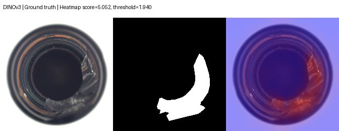
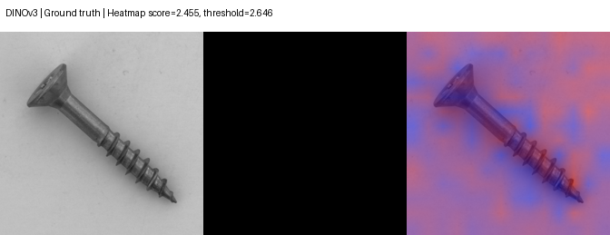
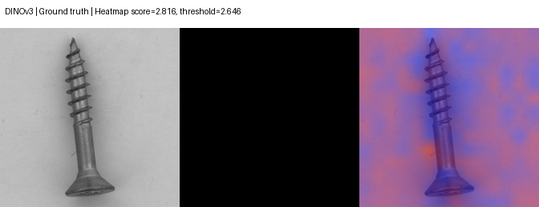
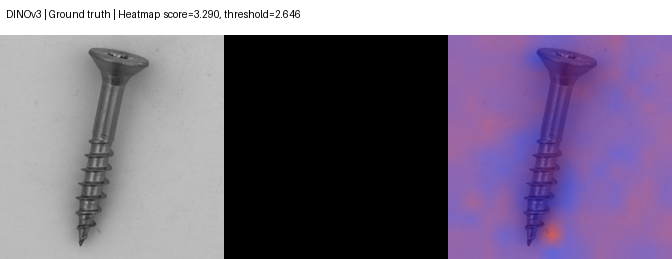
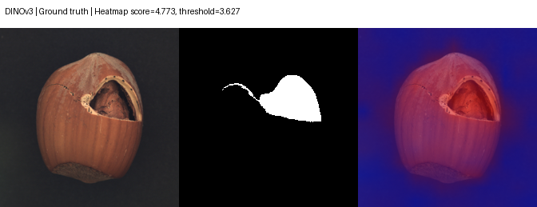
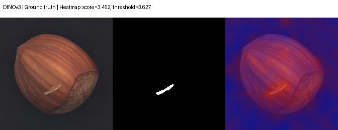
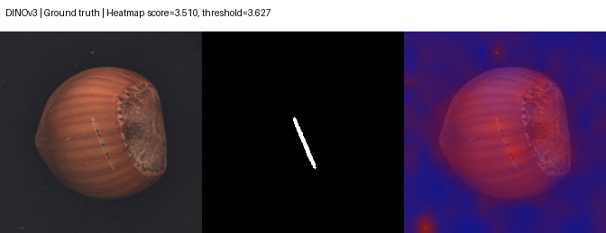
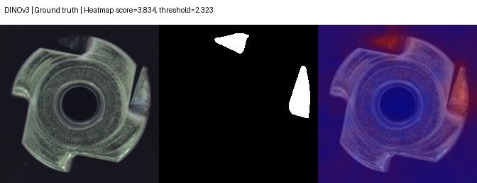
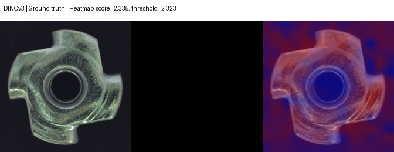
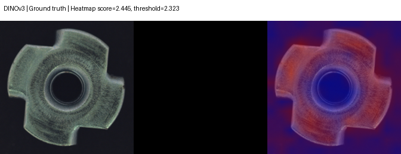

# DINOv3／DINOSaur 本机实验报告

实现 2026 年 DINOSaur 的冻结 DINOv3 特征、空间索引 coreset 与邻域限制评分核心，在本机 CPU 上与原有 ResNet18 局部特征基线对照。本实验是四个 MVTec AD 类别的核心方法适配，不能据此宣称复现整篇持续学习与边缘硬件 benchmark，也不能宣称全球 SOTA。

## 协议与来源

- 主方案：spatial_kcenter_r3；固定 coreset seeds 42、43、44，数据划分保持不变。
- 模型发布固定 seed 42；消融至少完成 seed 42，表中明确实际重复次数。
- 仅正常训练图建库，互斥 held-out 正常训练图的分数第 95 百分位确定阈值；测试集或缺陷标签不用于选阈值。
- 图像输入 224×224；pixel AUROC 在本实验 224 网格计算，不是 MVTec 原图尺度的官方定位指标。
- 三次 coreset seed 是同一测试集上的随机建库重复，标准差不是独立数据集置信区间。
- bottle、screw 测试集在早期基线实验中已经查看过，结果属于探索性复测；hazelnut、metal_nut 的首次评估可单独查记录。
- 权重：[timm/vit_small_patch16_dinov3.lvd1689m](https://huggingface.co/timm/vit_small_patch16_dinov3.lvd1689m)，revision 3bf4720a82ec2066db88137180ff1f83a675cef0，SHA256 2a1ec16ae28ffa07bc0ead0241ee7df9fc26451fe6f9f839b7b3afa0a906b040。
- 运行库 timm 1.0.30，CPU float32。token 使用最终 LayerNorm 输出，不另作 L2 归一化，以官方核心源码为准。
- 本 pipeline 按模型卡对 RoPE periods 作 bf16→float32 精度截断；timm API 替代仍不宣称与 Meta 原运行库逐位一致。下载 provenance 中的 RoPE 差异说明描述 timm 默认构造行为，须与此适配设置一起解读。
- [权重许可证](https://huggingface.co/timm/vit_small_patch16_dinov3.lvd1689m/blob/3bf4720a82ec2066db88137180ff1f83a675cef0/LICENSE.md)；[DINOSaur 官方代码](https://github.com/Continue-Edge-AI-Lab/Rethinking-Continual-AD)，[论文](https://arxiv.org/abs/2605.24251)。
- DINOv3 权重使用官方自定义 DINOv3 License，与项目自编代码许可分开；不将模型权重许可写成 MIT 或 Apache。[MVTec AD 原图及衍生可视化](https://www.mvtec.com/research-teaching/datasets/mvtec-ad)遵循 CC BY-NC-SA 4.0。

## 与原有基线比较

| 类别 | ResNet18 局部基线 AUROC | DINOv3 主方案图像 AUROC，mean ± std | 差值 | 主方案 pixel AUROC，mean ± std |
| --- | ---: | ---: | ---: | ---: |
| bottle | 0.9976 | 1.0000 ± 0.0000 | 0.0024 | 0.9785 ± 0.0001 |
| screw | 0.5190 | 0.7870 ± 0.0148 | 0.2681 | 0.8603 ± 0.0078 |
| hazelnut | 0.9350 | 0.9910 ± 0.0033 | 0.0560 | 0.9903 ± 0.0003 |
| metal_nut | 0.8827 | 0.9966 ± 0.0005 | 0.1139 | 0.9775 ± 0.0004 |

按图像 AUROC 的已记录均值，改善类别：bottle, screw, hazelnut, metal_nut；下降类别：无。每类结果均保留，不以单类别高分代替通用有效性。

## 消融

| 类别 | 方案 | 实际 seeds | 图像 AUROC | pixel AUROC | F1 |
| --- | --- | --- | ---: | ---: | ---: |
| bottle | spatial_kcenter_r3 | 42, 43, 44 | 1.0000 ± 0.0000 | 0.9785 ± 0.0001 | 1.0000 ± 0.0000 |
| bottle | spatial_random_r3 | 42 | 1.0000 (n=1) | 0.9794 (n=1) | 1.0000 (n=1) |
| bottle | unrestricted_kcenter | 42 | 1.0000 (n=1) | 0.9784 (n=1) | 1.0000 (n=1) |
| bottle | spatial_kcenter_r0 | 42 | 1.0000 (n=1) | 0.9804 (n=1) | 1.0000 (n=1) |
| screw | spatial_kcenter_r3 | 42, 43, 44 | 0.7870 ± 0.0148 | 0.8603 ± 0.0078 | 0.6233 ± 0.0565 |
| screw | spatial_random_r3 | 42 | 0.7003 (n=1) | 0.8452 (n=1) | 0.4540 (n=1) |
| screw | unrestricted_kcenter | 42 | 0.7914 (n=1) | 0.8668 (n=1) | 0.6448 (n=1) |
| screw | spatial_kcenter_r0 | 42 | 0.7010 (n=1) | 0.8309 (n=1) | 0.5618 (n=1) |
| hazelnut | spatial_kcenter_r3 | 42, 43, 44 | 0.9910 ± 0.0033 | 0.9903 ± 0.0003 | 0.9507 ± 0.0045 |
| hazelnut | spatial_random_r3 | 42 | 0.9911 (n=1) | 0.9911 (n=1) | 0.9333 (n=1) |
| hazelnut | unrestricted_kcenter | 42 | 0.9954 (n=1) | 0.9905 (n=1) | 0.9481 (n=1) |
| hazelnut | spatial_kcenter_r0 | 42 | 0.9893 (n=1) | 0.9905 (n=1) | 0.9481 (n=1) |
| metal_nut | spatial_kcenter_r3 | 42, 43, 44 | 0.9966 ± 0.0005 | 0.9775 ± 0.0004 | 0.9840 ± 0.0000 |
| metal_nut | spatial_random_r3 | 42 | 0.9932 (n=1) | 0.9766 (n=1) | 0.9785 (n=1) |
| metal_nut | unrestricted_kcenter | 42 | 0.9971 (n=1) | 0.9781 (n=1) | 0.9840 (n=1) |
| metal_nut | spatial_kcenter_r0 | 42 | 0.9917 (n=1) | 0.9761 (n=1) | 0.9735 (n=1) |

## 固定阈值下的实际判断

| 类别 | seed | 阈值 | TP | FP | FN | TN | F1 |
| --- | ---: | ---: | ---: | ---: | ---: | ---: | ---: |
| bottle | 42 | 1.939613 | 63 | 0 | 0 | 20 | 1.0000 |
| bottle | 43 | 1.966695 | 63 | 0 | 0 | 20 | 1.0000 |
| bottle | 44 | 1.939613 | 63 | 0 | 0 | 20 | 1.0000 |
| screw | 42 | 2.645730 | 60 | 5 | 59 | 36 | 0.6522 |
| screw | 43 | 2.775155 | 48 | 5 | 71 | 36 | 0.5581 |
| screw | 44 | 2.691242 | 61 | 5 | 58 | 36 | 0.6595 |
| hazelnut | 42 | 3.627355 | 65 | 1 | 5 | 39 | 0.9559 |
| hazelnut | 43 | 3.623149 | 64 | 1 | 6 | 39 | 0.9481 |
| hazelnut | 44 | 3.626462 | 64 | 1 | 6 | 39 | 0.9481 |
| metal_nut | 42 | 2.323103 | 92 | 2 | 1 | 20 | 0.9840 |
| metal_nut | 43 | 2.263338 | 92 | 2 | 1 | 20 | 0.9840 |
| metal_nut | 44 | 2.268977 | 92 | 2 | 1 | 20 | 0.9840 |

## 每种缺陷与正常图的错误分布

以下直接从固定 seed 42 的正式 predictions.csv 汇总，没有重跑、改图、改阈值或改参数。异常类型重点看漏检 FN，good 重点看误报 FP；所有已记录类型都保留。

| 类别 | 类型 | n | 新 TP | 新 FP | 新 FN | 新 TN | 旧 FN | 旧 FP |
| --- | --- | ---: | ---: | ---: | ---: | ---: | ---: | ---: |
| bottle | broken_large | 20 | 20 | 0 | 0 | 0 | 0 | 0 |
| bottle | broken_small | 22 | 22 | 0 | 0 | 0 | 0 | 0 |
| bottle | contamination | 21 | 21 | 0 | 0 | 0 | 0 | 0 |
| bottle | good | 20 | 0 | 0 | 0 | 20 | 0 | 1 |
| screw | good | 41 | 0 | 5 | 0 | 36 | 0 | 5 |
| screw | manipulated_front | 24 | 14 | 0 | 10 | 0 | 22 | 0 |
| screw | scratch_head | 24 | 6 | 0 | 18 | 0 | 23 | 0 |
| screw | scratch_neck | 25 | 19 | 0 | 6 | 0 | 22 | 0 |
| screw | thread_side | 23 | 6 | 0 | 17 | 0 | 21 | 0 |
| screw | thread_top | 23 | 15 | 0 | 8 | 0 | 20 | 0 |
| hazelnut | crack | 18 | 18 | 0 | 0 | 0 | 2 | 0 |
| hazelnut | cut | 17 | 13 | 0 | 4 | 0 | 2 | 0 |
| hazelnut | good | 40 | 0 | 1 | 0 | 39 | 0 | 2 |
| hazelnut | hole | 18 | 18 | 0 | 0 | 0 | 1 | 0 |
| hazelnut | print | 17 | 16 | 0 | 1 | 0 | 11 | 0 |
| metal_nut | bent | 25 | 25 | 0 | 0 | 0 | 10 | 0 |
| metal_nut | color | 22 | 22 | 0 | 0 | 0 | 15 | 0 |
| metal_nut | flip | 23 | 23 | 0 | 0 | 0 | 3 | 0 |
| metal_nut | good | 22 | 0 | 2 | 0 | 20 | 0 | 1 |
| metal_nut | scratch | 23 | 22 | 0 | 1 | 0 | 8 | 0 |

螺丝漏检减少的类型：manipulated_front（FN 22→10）；scratch_head（FN 23→18）；scratch_neck（FN 22→6）；thread_side（FN 21→17）；thread_top（FN 20→8）。
新版 seed 42 漏检率最高类型为 scratch_head：18/24。改善不表示生产可用；剩余漏检与误报仍需正面处理。旋转、尺度或细小缺陷可能影响空间匹配，但这只是待验证假设，错误表不能单独证明因果。

## CPU 时间与特征库

| 类别 | 新方案 threads | 基线 threads | 库 MiB | 库向量数 | 特征提取 mean ms | 评分 median ms | 评分 p95 ms | coreset 秒 |
| --- | ---: | ---: | ---: | ---: | ---: | ---: | ---: | ---: |
| bottle | 1 | 4 | 5.74 ± 0.00 | 3920 ± 0 | 1062.0 ± 0.0 | 947.8 ± 64.8 | 1574.2 ± 291.1 | 2.2 ± 0.8 |
| screw | 1 | 4 | 7.18 ± 0.00 | 4900 ± 0 | 1241.5 ± 0.0 | 999.2 ± 131.3 | 1505.7 ± 292.2 | 2.4 ± 1.2 |
| hazelnut | 1 | 1 | 8.90 ± 0.00 | 6076 ± 0 | 792.0 ± 0.0 | 904.1 ± 43.4 | 1358.4 ± 73.9 | 3.0 ± 1.1 |
| metal_nut | 1 | 4 | 5.74 ± 0.00 | 3920 ± 0 | 557.5 ± 0.0 | 466.2 ± 81.2 | 634.9 ± 100.7 | 0.8 ± 0.0 |

评分时间只包括已提取特征的异常评分，不能当作完整单图推理耗时；特征提取 mean 与评分 median 的相加也不是端到端 median。完整耗时应看网页 API 的 preprocess＋forward＋score 实测。库 MiB 是保存特征占用，不是进程内存峰值。

新方案与历史基线的线程数和运行时后台负载不同，这些时间记录只能描述各次实际运行，不能直接计算公平加速比或推断某方法必然更快。

## 持续加入类别

正常库按类别依次加入，以最近 CLS 原型自动路由测试图。后续类别加入后，即使原有库向量完全不变，更多候选原型也可能改变路由和最终异常判断。

| 阶段 | 新加入类别 | 评估类别 | 路由准确率 | 图像 AUROC | TP | FP | FN | TN | 测试数 |
| ---: | --- | --- | ---: | ---: | ---: | ---: | ---: | ---: | ---: |
| 1 | bottle | bottle | 1.0000 | 1.0000 | 63 | 0 | 0 | 20 | 83 |
| 2 | screw | bottle | 1.0000 | 1.0000 | 63 | 0 | 0 | 20 | 83 |
| 2 | screw | screw | 1.0000 | 0.7963 | 60 | 5 | 59 | 36 | 160 |
| 3 | hazelnut | bottle | 1.0000 | 1.0000 | 63 | 0 | 0 | 20 | 83 |
| 3 | hazelnut | screw | 1.0000 | 0.7963 | 60 | 5 | 59 | 36 | 160 |
| 3 | hazelnut | hazelnut | 1.0000 | 0.9929 | 65 | 1 | 5 | 39 | 110 |
| 4 | metal_nut | bottle | 1.0000 | 1.0000 | 63 | 0 | 0 | 20 | 83 |
| 4 | metal_nut | screw | 1.0000 | 0.7963 | 60 | 5 | 59 | 36 | 160 |
| 4 | metal_nut | hazelnut | 1.0000 | 0.9929 | 65 | 1 | 5 | 39 | 110 |
| 4 | metal_nut | metal_nut | 1.0000 | 0.9971 | 92 | 2 | 1 | 20 | 115 |

记录中的已有库内容保持不变检查：True。

| 类别 | 首次出现阶段 | 最后阶段 | AUROC 首次 | AUROC 最后 | 最后－首次 | 路由准确率 首次→最后 |
| --- | ---: | ---: | ---: | ---: | ---: | --- |
| bottle | 1 | 4 | 1.0000 | 1.0000 | 0.0000 | 1.0000→1.0000 |
| screw | 2 | 4 | 0.7963 | 0.7963 | 0.0000 | 1.0000→1.0000 |
| hazelnut | 3 | 4 | 0.9929 | 0.9929 | 0.0000 | 1.0000→1.0000 |
| metal_nut | 4 | 4 | 0.9971 | 0.9971 | 0.0000 | 1.0000→1.0000 |

上表差值只是本次固定 seed 42、同一测试集、该类别加入顺序下的实际观测。库哈希不变不能直接证明实际系统零遗忘；判断还依赖 CLS 路由。本序列也不替代原论文的连续漂移、逻辑异常或边缘硬件 benchmark。

## 定位与错误样本

保留固定 seed 42 主方案已生成的全部 PNG，包含程序保存的 error-* 失败图，无需重新推理或按新成绩换图。下图顺序为输入／标注／热力图；热力图颜色是单图缩放，不能当作异常概率。

### bottle

全部已保存图（包含其余失败图）：

- [broken_large-000.png](frontier/examples/bottle/broken_large-000.png)
- [broken_large-001.png](frontier/examples/bottle/broken_large-001.png)
- [broken_small-000.png](frontier/examples/bottle/broken_small-000.png)
- [broken_small-001.png](frontier/examples/bottle/broken_small-001.png)
- [contamination-000.png](frontier/examples/bottle/contamination-000.png)
- [contamination-001.png](frontier/examples/bottle/contamination-001.png)
- [good-000.png](frontier/examples/bottle/good-000.png)
- [good-001.png](frontier/examples/bottle/good-001.png)

### screw

全部已保存图（包含其余失败图）：

- [error-good-004.png](frontier/examples/screw/error-good-004.png)
- [error-good-008.png](frontier/examples/screw/error-good-008.png)
- [error-good-014.png](frontier/examples/screw/error-good-014.png)
- [error-good-026.png](frontier/examples/screw/error-good-026.png)
- [error-good-035.png](frontier/examples/screw/error-good-035.png)
- [error-manipulated_front-002.png](frontier/examples/screw/error-manipulated_front-002.png)
- [error-manipulated_front-004.png](frontier/examples/screw/error-manipulated_front-004.png)
- [error-manipulated_front-008.png](frontier/examples/screw/error-manipulated_front-008.png)
- [error-thread_side-000.png](frontier/examples/screw/error-thread_side-000.png)
- [error-thread_side-001.png](frontier/examples/screw/error-thread_side-001.png)
- [good-000.png](frontier/examples/screw/good-000.png)
- [good-001.png](frontier/examples/screw/good-001.png)
- [manipulated_front-000.png](frontier/examples/screw/manipulated_front-000.png)
- [manipulated_front-001.png](frontier/examples/screw/manipulated_front-001.png)
- [scratch_head-000.png](frontier/examples/screw/scratch_head-000.png)
- [scratch_head-001.png](frontier/examples/screw/scratch_head-001.png)
- [scratch_neck-000.png](frontier/examples/screw/scratch_neck-000.png)
- [scratch_neck-001.png](frontier/examples/screw/scratch_neck-001.png)
- [thread_top-000.png](frontier/examples/screw/thread_top-000.png)
- [thread_top-001.png](frontier/examples/screw/thread_top-001.png)

### hazelnut

全部已保存图（包含其余失败图）：

- [crack-000.png](frontier/examples/hazelnut/crack-000.png)
- [crack-001.png](frontier/examples/hazelnut/crack-001.png)
- [cut-001.png](frontier/examples/hazelnut/cut-001.png)
- [error-cut-000.png](frontier/examples/hazelnut/error-cut-000.png)
- [error-cut-003.png](frontier/examples/hazelnut/error-cut-003.png)
- [error-cut-005.png](frontier/examples/hazelnut/error-cut-005.png)
- [error-cut-010.png](frontier/examples/hazelnut/error-cut-010.png)
- [error-good-002.png](frontier/examples/hazelnut/error-good-002.png)
- [error-print-015.png](frontier/examples/hazelnut/error-print-015.png)
- [good-000.png](frontier/examples/hazelnut/good-000.png)
- [good-001.png](frontier/examples/hazelnut/good-001.png)
- [hole-000.png](frontier/examples/hazelnut/hole-000.png)
- [hole-001.png](frontier/examples/hazelnut/hole-001.png)
- [print-000.png](frontier/examples/hazelnut/print-000.png)
- [print-001.png](frontier/examples/hazelnut/print-001.png)

### metal_nut

全部已保存图（包含其余失败图）：

- [bent-000.png](frontier/examples/metal_nut/bent-000.png)
- [bent-001.png](frontier/examples/metal_nut/bent-001.png)
- [color-000.png](frontier/examples/metal_nut/color-000.png)
- [color-001.png](frontier/examples/metal_nut/color-001.png)
- [error-good-008.png](frontier/examples/metal_nut/error-good-008.png)
- [error-good-016.png](frontier/examples/metal_nut/error-good-016.png)
- [error-scratch-020.png](frontier/examples/metal_nut/error-scratch-020.png)
- [flip-000.png](frontier/examples/metal_nut/flip-000.png)
- [flip-001.png](frontier/examples/metal_nut/flip-001.png)
- [good-000.png](frontier/examples/metal_nut/good-000.png)
- [good-001.png](frontier/examples/metal_nut/good-001.png)
- [scratch-000.png](frontier/examples/metal_nut/scratch-000.png)
- [scratch-001.png](frontier/examples/metal_nut/scratch-001.png)

## 证据与可复现范围

- 每次正式运行的 config、summary、predictions 保存在 reports/frontier/run_records。
- reports/frontier/evidence.json 记录完整运行来源、输入统计、文件 SHA256、结果汇总与缺失检查。
- release/frontier/<category>/model.pt 使用固定 seed 42 主方案；backbone 权重在 cache/frontier，本源码包不附权重。
- 当前类别有限；无法将工业俯视样本检测结果推广到任意网络照片。

