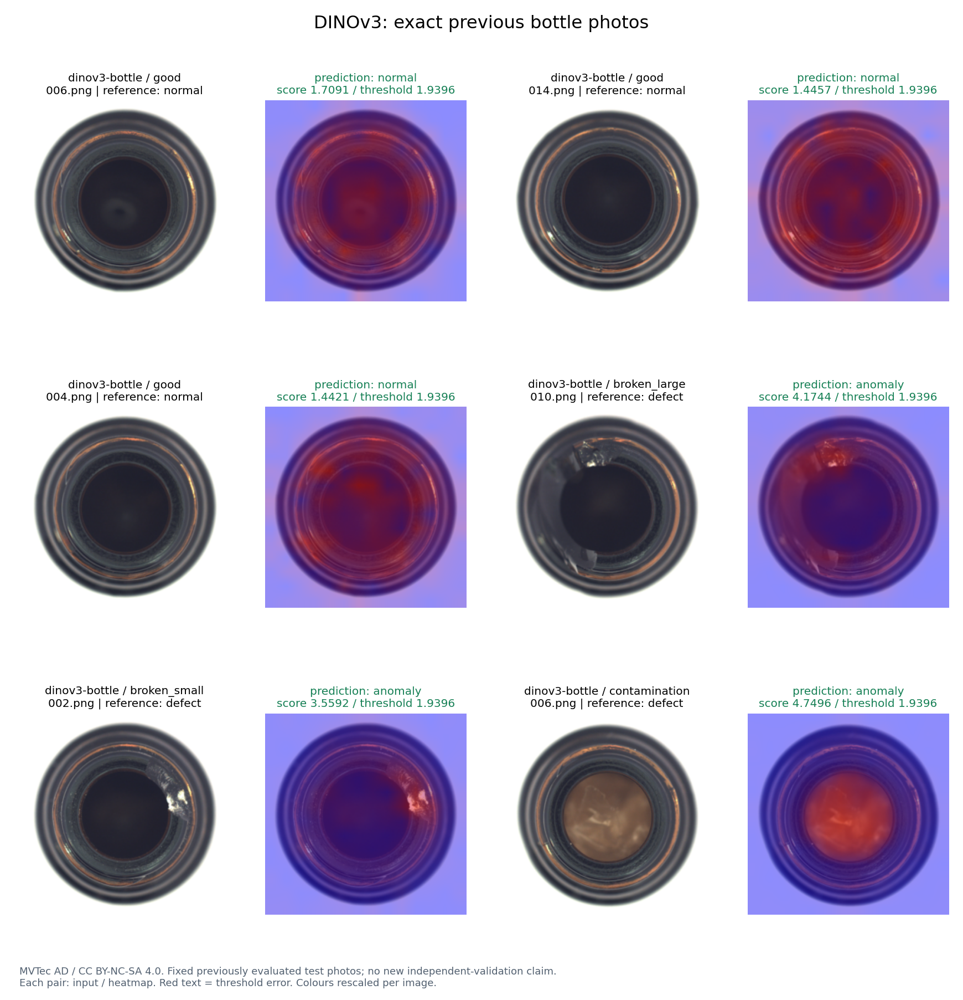
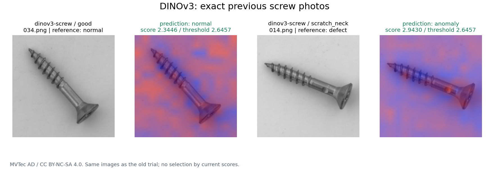
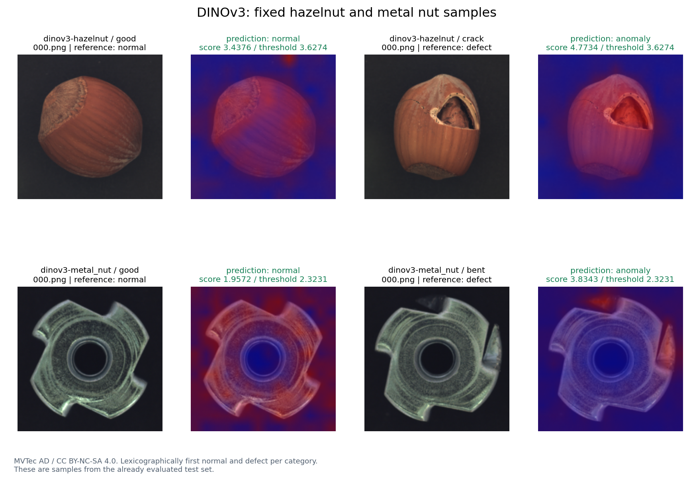
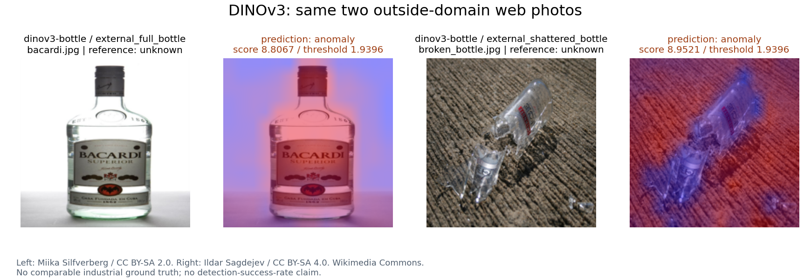

# 新版 DINOv3：固定 14 张图片实际试用

使用已发布的固定 seed 42 DINOSaur 主方案和正常验证集阈值，通过网页服务同一个 Engine 推理函数逐图运行，没有重建库、改阈值、按结果换图或重新下载外部照片。

前 10 张与旧版试用完全相同，SHA256 与旧记录核对；另外按文件名排序各取 hazelnut、metal_nut 一张正常和一张缺陷图，路径在推理前冻结。12 张域内图来自已评估测试集，是直观试用，不能当作新独立验证。2 张 Wikimedia 普通照片标记 domain_shift，没有可比工业标签，不计检测成功率。

域内本次判断：12/12 正确，FP=0，FN=0。这是固定样本展示，不能代替完整类别成绩。

| 图片 | 参考标签 | 旧版判断 | DINOv3 分数 | 阈值 | 新版判断 | 核对 | 预处理＋forward＋评分 ms |
| --- | --- | --- | ---: | ---: | --- | --- | ---: |
| data/mvtec/bottle/test/good/006.png | 正常 | 异常 | 1.7091 | 1.9396 | 正常 | correct | 1607.5 |
| data/mvtec/bottle/test/good/014.png | 正常 | 正常 | 1.4457 | 1.9396 | 正常 | correct | 1280.5 |
| data/mvtec/bottle/test/good/004.png | 正常 | 正常 | 1.4421 | 1.9396 | 正常 | correct | 1153.7 |
| data/mvtec/bottle/test/broken_large/010.png | 异常 | 异常 | 4.1744 | 1.9396 | 异常 | correct | 1716.1 |
| data/mvtec/bottle/test/broken_small/002.png | 异常 | 异常 | 3.5592 | 1.9396 | 异常 | correct | 1296.9 |
| data/mvtec/bottle/test/contamination/006.png | 异常 | 异常 | 4.7496 | 1.9396 | 异常 | correct | 1160.0 |
| data/mvtec/screw/test/good/034.png | 正常 | 正常 | 2.3446 | 2.6457 | 正常 | correct | 1573.8 |
| data/mvtec/screw/test/scratch_neck/014.png | 异常 | 正常 | 2.9430 | 2.6457 | 异常 | correct | 1780.6 |
| data/external_trials/bacardi.jpg | 无可比工业标签 | 异常 | 8.8067 | 1.9396 | 异常 | 场景外，不计成功率 | 1066.1 |
| data/external_trials/broken_bottle.jpg | 无可比工业标签 | 异常 | 8.9521 | 1.9396 | 异常 | 场景外，不计成功率 | 1029.4 |
| data/mvtec/hazelnut/test/good/000.png | 正常 | — | 3.4376 | 3.6274 | 正常 | correct | 1307.1 |
| data/mvtec/hazelnut/test/crack/000.png | 异常 | — | 4.7734 | 3.6274 | 异常 | correct | 1405.7 |
| data/mvtec/metal_nut/test/good/000.png | 正常 | — | 1.9572 | 2.3231 | 正常 | correct | 1259.6 |
| data/mvtec/metal_nut/test/bent/000.png | 异常 | — | 3.8343 | 2.3231 | 异常 | correct | 853.4 |

计时来自 Engine 的实际预处理＋骨干前向＋异常评分；不含模型加载、磁盘文件解码、热力图渲染和保存。线程数为 1，后台负载可能变化，不用旧记录计算公平加速比。两种方法的距离尺度不同，不根据裸分数高低判断优劣。

热力图单图归一化；位置颜色不是概率。外部照片高距离只表示偏离正常工业特征库，不能解释为准确识别瓶子破损。

## 来源与复查

[路径、SHA256、逐图结果、发布模型哈希](FRONTIER_IMAGE_TRIALS.json)。

- [MVTec AD](https://www.mvtec.com/research-teaching/datasets/mvtec-ad)：原图与衍生可视化遵循 CC BY-NC-SA 4.0。
- [DINOv3 模型卡](https://huggingface.co/timm/vit_small_patch16_dinov3.lvd1689m)：权重使用官方自定义 DINOv3 License，与项目自编代码许可分开。
- [bacardi.jpg](https://commons.wikimedia.org/wiki/File:Bacardi_(on_white).jpg)：Miika Silfverberg，[CC BY-SA 2.0](https://creativecommons.org/licenses/by-sa/2.0/)；缩放并叠加热力图。
- [broken_bottle.jpg](https://commons.wikimedia.org/wiki/File:2008-03-09_Broken_glass_bottle.jpg)：Ildar Sagdejev，[CC BY-SA 4.0](https://creativecommons.org/licenses/by-sa/4.0/)；缩放并叠加热力图。
