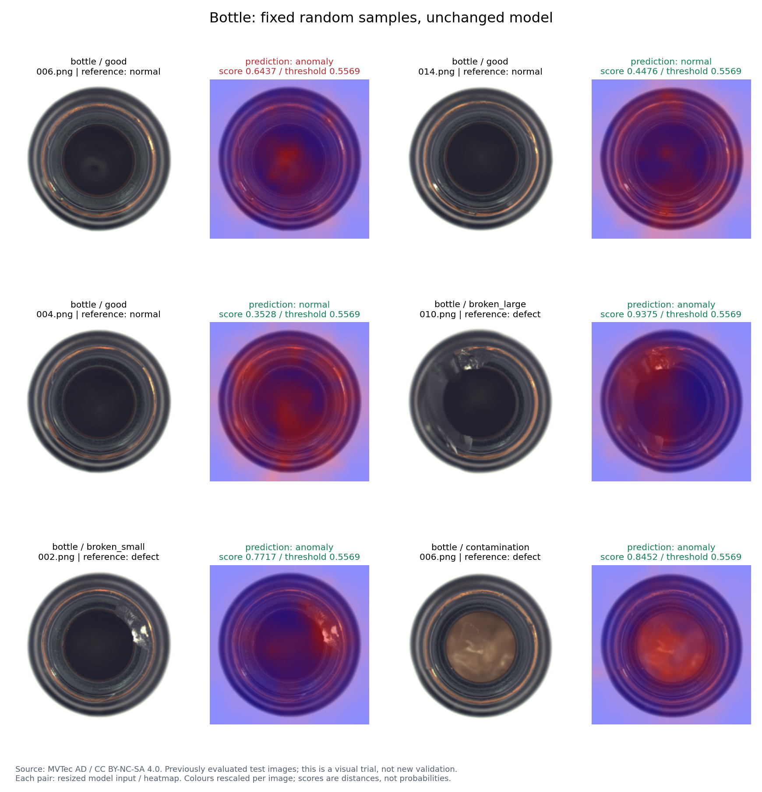
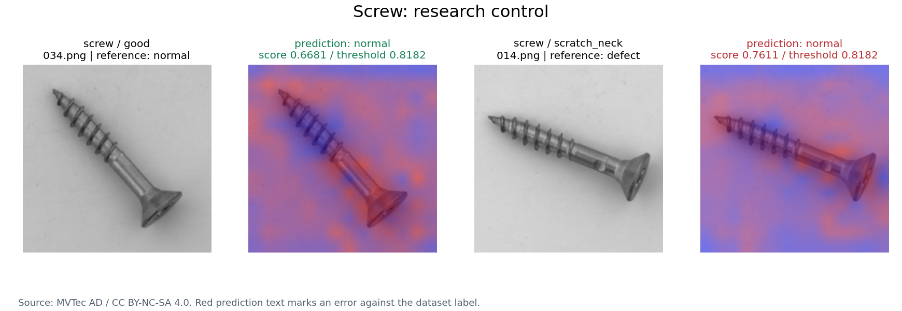
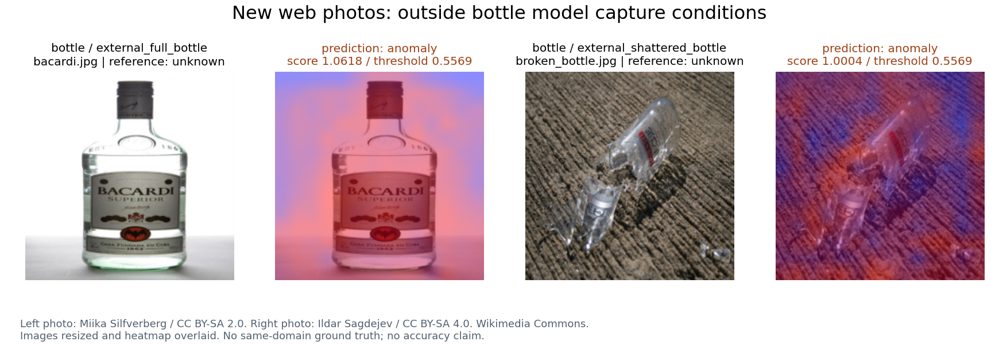

# 公开图片实际检测

使用已发布的模型和原有阈值，通过本机网页同一 HTTP 接口逐图推理；没有重建特征库、改阈值或调参。

8 张 MVTec 图片按 seed=20261009 固定抽取。它们属于此前已经评估的官方测试集，本次用于直观试验，不能算新的独立泛化证据。另有 2 张新下载的 Wikimedia 普通照片，用于检查拍摄场景不匹配时的表现。

| 图片 | 参考情况 | 分数 | 阈值 | 模型判断 | 核对 |
|---|---|---:|---:|---|---|
| data/mvtec/bottle/test/good/006.png | 正常 | 0.6437 | 0.5569 | 异常 | 误报 |
| data/mvtec/bottle/test/good/014.png | 正常 | 0.4476 | 0.5569 | 正常 | 正确 |
| data/mvtec/bottle/test/good/004.png | 正常 | 0.3528 | 0.5569 | 正常 | 正确 |
| data/mvtec/bottle/test/broken_large/010.png | 大破损 | 0.9375 | 0.5569 | 异常 | 正确 |
| data/mvtec/bottle/test/broken_small/002.png | 小破损 | 0.7717 | 0.5569 | 异常 | 正确 |
| data/mvtec/bottle/test/contamination/006.png | 污染 | 0.8452 | 0.5569 | 异常 | 正确 |
| data/mvtec/screw/test/good/034.png | 正常 | 0.6681 | 0.8182 | 正常 | 正确 |
| data/mvtec/screw/test/scratch_neck/014.png | 螺丝颈部划痕 | 0.7611 | 0.8182 | 正常 | 漏检 |
| data/external_trials/bacardi.jpg | 完整瓶外观／工业标签未知 | 1.0618 | 0.5569 | 异常 | 场景外，不计准确率 |
| data/external_trials/broken_bottle.jpg | 来源描述破碎瓶／工业标签未知 | 1.0004 | 0.5569 | 异常 | 场景外，不计准确率 |

普通侧视整瓶／碎玻璃照片与训练的瓶口俯视图不同。高异常距离表示偏离正常特征库，不能解释为成功识别具体缺陷。

## 来源与复查

[固定样本清单](IMAGE_TRIAL_SELECTION.json) · [逐图原始分数](IMAGE_TRIAL_RESULTS.json)

- [bacardi.jpg](https://commons.wikimedia.org/wiki/File:Bacardi_(on_white).jpg)：Miika Silfverberg，[CC BY-SA 2.0](https://creativecommons.org/licenses/by-sa/2.0/)。图表中缩放并叠加热力图。
- [broken_bottle.jpg](https://commons.wikimedia.org/wiki/File:2008-03-09_Broken_glass_bottle.jpg)：Ildar Sagdejev，[CC BY-SA 4.0](https://creativecommons.org/licenses/by-sa/4.0/)。图表中缩放并叠加热力图。
- [MVTec AD 数据来源](https://www.mvtec.com/research-teaching/datasets/mvtec-ad)：CC BY-NC-SA 4.0。
