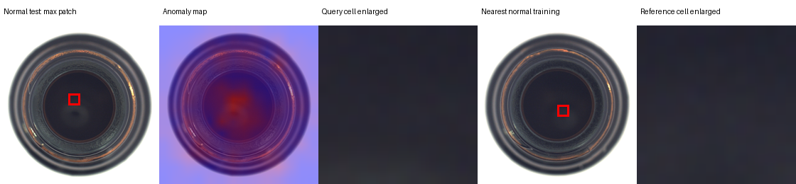

# 第二轮实验：同层特征对比与误报分析

本轮为首轮测试之后的探索性分析。所有方案的数据哈希、训练／校准／测试文件列表均核验一致；没有修改原有模型或基于测试标签调阈值。

| 方案 | 图像 AUROC | F1 | 漏检 | 误报 | 库向量数 | 库 MiB |
|---|---:|---:|---:|---:|---:|---:|
| 原始整图：layer4 / 512 维 | 0.9937 | 0.9764 | 1 | 2 | 167 | 0.326 |
| 同层整图：layer2+3 / 64 维 | 0.9698 | 0.9683 | 2 | 2 | 167 | 0.041 |
| 局部：layer2+3 / 64 维 | 0.9976 | 0.9921 | 0 | 1 | 2000 | 0.488 |

## 能支持的结论

同层整图与局部方案使用完全相同的 layer2+layer3 原始特征和同一组 64 个通道。整图先空间平均再归一化，局部保留 patch 并逐个归一化与匹配。
这排除了首轮对比中的特征层级与维度差异，但特征库构成、向量数量和分数聚合方式仍随方案改变。该实验比较的是表示与评分策略，不能归因于单一因素，也不能推广为所有产品上的结论。
固定阈值只来自各方案的正常校准分数。高 AUROC 不代表任意阈值下都没有误报。

## 冻结模型的误报追溯

正常图片 `test\good\006.png` 的分数是 0.6437，阈值为 0.5569，超出 0.0868。
最高分 patch 位于 14×14 网格的行列 [6, 6]（从 0 开始），224 输入上的网格框为 [96, 96, 112, 112]。

| 最近邻正常训练图片 | patch 行列 | 特征距离 |
|---|---|---:|
| train\good\097.png | [7, 7] | 0.6437 |
| train\good\000.png | [3, 6] | 0.7440 |
| train\good\014.png | [3, 6] | 0.7476 |

图中从左到右为正常测试图、高分热力图、最高分网格单元放大图、最近邻正常训练图及对应单元。框表示网格位置，不等于 CNN 的完整感受野。

## 正常校准样本的高分尾部

| 正常校准图片 | 最高分 | 最高分 patch 行列 |
|---|---:|---|
| train\good\007.png | 0.5817 | [7, 13] |
| train\good\009.png | 0.5813 | [6, 6] |
| train\good\020.png | 0.5575 | [6, 6] |
| train\good\038.png | 0.5445 | [11, 6] |
| train\good\106.png | 0.5414 | [6, 7] |

上述最高分的 5 张正常校准图中，有 2 张的最高分网格位置与测试误报相同。这说明该位置的正常高分现象不只出现在该测试图片上，但仍不足以证明具体原因。

## 分析边界与下一步

该正常图片在瓶底内部出现较高分数，表明冻结模型将此处的正常外观判作与特征库不够相似。反光、内部纹理变化或正常库覆盖不足是待验证假设，最近邻距离本身不能确定具体原因。
本轮没有提高阈值或裁掉该区域以消除测试误报。下一轮可用训练侧合成缺陷验证库采样与聚合策略；最终泛化效果需要新的独立类别或数据。
耗时受后台负载影响，不能从两次单次运行声称严格加速。

## 可复查的运行文件

- [bottle-20261008-175458-global-64-2000](run_records/bottle-20261008-175458-global-64-2000/summary.json)
- [bottle-20261008-180752-global_shared-64-2000](run_records/bottle-20261008-180752-global_shared-64-2000/summary.json)
- [bottle-20261008-175949-local-64-2000](run_records/bottle-20261008-175949-local-64-2000/summary.json)
- [诊断数字记录](error_diagnosis.json)
- [实验运行前固定的第二轮协议](../ROUND2_PROTOCOL.md)
