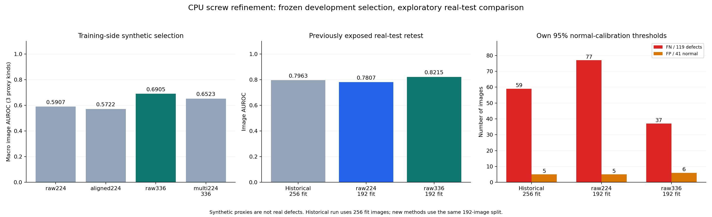
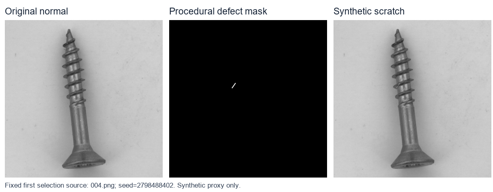
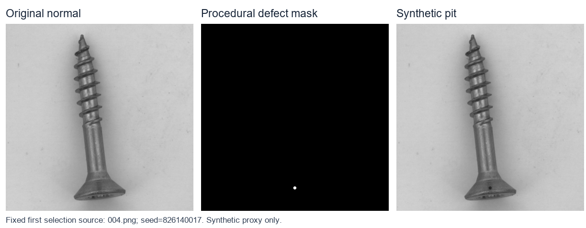
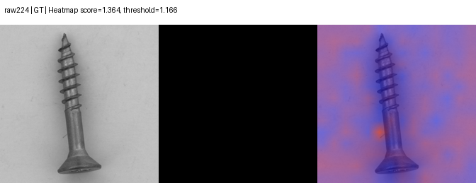
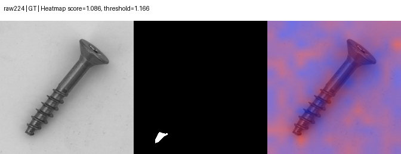
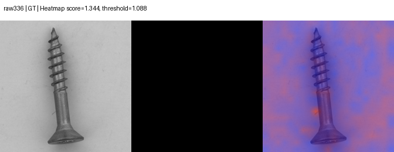
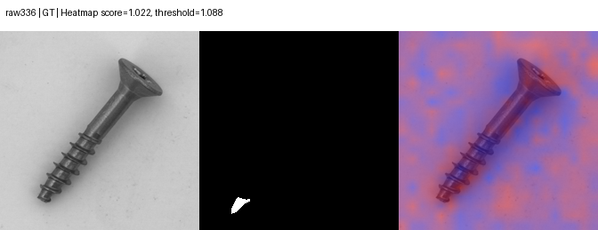
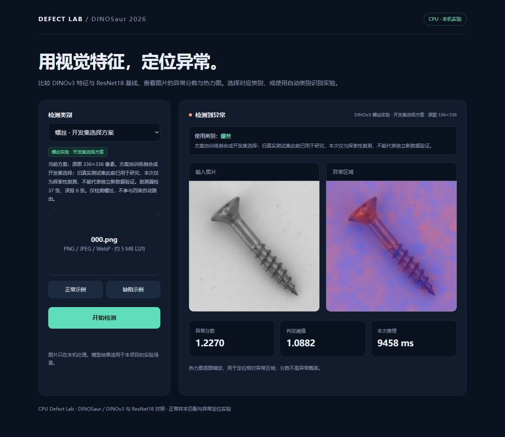

# 螺丝漏检改进：实际实验报告

开发侧选中 **原始336（`raw336`）**。真实探索性复测相对同192张建库图对照，图像AUROC变化为 **+0.0408**，漏检从 **77** 变为 **37**，误报从 **5** 变为 **6**。

相对旧256张建库图的历史发布模型，漏检从 **59** 变为 **37**，误报从 **5** 变为 **6**。这是不同建库数量的历史比较，不能替代同192图对照。

本轮结果固定一个建库种子42，不是三个种子的均值；没有测量本轮多种子稳定性。实际winner是原始336分支，姿态对齐和多尺度仅作为未选中的开发候选，不应把它们描述为发布模型的组成。

这是一轮CPU上的冻结特征实验，没有从零训练或微调DINOv3，也没有使用Ollama。官方螺丝test此前已全部查看，本轮真实结果均是**探索性复测**。合成审计只提供训练侧代理缺陷证据，不能称为未见真实工业缺陷验证。



## 方案与数据边界

旧256张正常建库图被重新分为192张fit、48张selection正常源图、16张audit正常源图；保留旧64张正常校准图。四组源图互斥。三个代理缺陷在原始分辨率生成，每个选择源图各三种，共144张；审计有16正常源图及48代理缺陷。所有候选使用冻结DINOv3 ViT-S/16，骨干与特征在CPU上为float32，单线程、固定种子42的逐位置k-center库；检索候选计算使用float64。

| 候选 | 处理与检索 | 分数 |
|---|---|---|
| 原始224 | 14×14网格，半径3 | 最大patch距离 / 48开发正常图中位数 |
| 原始336 | 21×21网格，半径4 | 最大patch距离 / 48开发正常图中位数 |
| 姿态对齐224 | 前景主轴旋转居中，无crop和额外缩放 | 质量通过使用对齐库，否则使用原始224库和对应中位数 |
| 224＋336 | 同一原图坐标，两尺度各自正常化后插值到224 | 两幅图等权平均，取融合图最大值 |

336/半径4是相对空间范围的近似取整，与224/半径3的物理范围并不完全相同。融合插值可能平滑峰值，图像分数不是两个最大值的平均。对齐库只采用质量通过的fit图，因此与原始库相比还存在可用训练图数差别。低质量图绝不匹配对齐库。

完整预先协议见 [冻结协议副本](screw_refinement/run_records/SCREW_REFINEMENT_PROTOCOL.md)，配置与源码身份见 [protocol.json](screw_refinement/run_records/protocol.json) 和 [source_identity.json](screw_refinement/run_records/source_identity.json)。

## 开发侧选择：全部候选

三种代理缺陷分别与同48张正常图计算AUROC，取三者平均。复杂方案至少比原始224高0.005才接受；精确并列按原始224、对齐224、原始336、多尺度顺序。正常尺度统计在代理评分前冻结；正常校准集和审计集均不参与选择。

| 候选 | 划痕AUROC | 暗斑AUROC | 位移AUROC | 宏平均 | 是否选中 |
|---|---:|---:|---:|---:|---|
| 原始224 | 0.7244 | 0.5113 | 0.5365 | 0.5907 | 否 |
| 姿态对齐224 | 0.6784 | 0.5299 | 0.5082 | 0.5722 | 否 |
| 原始336 | 0.7734 | 0.7287 | 0.5694 | 0.6905 | 是 |
| 224＋336多尺度 | 0.7691 | 0.5994 | 0.5885 | 0.6523 | 否 |

开发侧最佳代理候选是 `raw336`，最终冻结winner为 `raw336`。两者可能因0.005接受门槛不同。候选没有根据官方test重新选择。

## 合成审计与生成样例

选定后，在16个不同正常源图及48代理缺陷上报告审计。审计不改变winner。代理缺陷共享源图，不能把48或144张代理图当成同样数量的独立真实缺陷。

| 审计候选 | 划痕AUROC | 暗斑AUROC | 位移AUROC | 宏平均 |
|---|---:|---:|---:|---:|
| 原始224 | 0.6641 | 0.5781 | 0.5117 | 0.5846 |
| 原始336 | 0.8398 | 0.7148 | 0.5469 | 0.7005 |

细划痕示例：左为正常源图，中为生成操作mask，右为合成图。固定取清单中的第一张该类选择样例，不按检测成功挑图。



暗斑/凹点示例：左为正常源图，中为生成操作mask，右为合成图。固定取清单中的第一张该类选择样例，不按检测成功挑图。



局部纹理位移示例：左为正常源图，中为生成操作mask，右为合成图。固定取清单中的第一张该类选择样例，不按检测成功挑图。


生成位置仅来自正常训练图的前景估计，参数、种子、mask和文件哈希见 [synthetic_manifest.json](screw_refinement/run_records/synthetic_manifest.json)。细划痕、暗斑、位移只是代理异常，并没有证明其统计性质等同于真实工业缺陷。

## 相同真实图片上的探索性复测

每个新方法在同64张正常校准图上计算自己的95%分位阈值。分数正常化不是概率，不能直接跨模型比较原始分数高低。阈值没有根据test调整，经验95%分位数也不保证未来5%误报。

| 模型 | 建库图 | 图像AUROC | TP | FN/119 | FP/41 | TN | 缺陷召回 | 正常误报率 |
|---|---:|---:|---:|---:|---:|---:|---:|---:|
| 旧发布模型（历史） | 256 | 0.7963 | 60 | 59 | 5 | 36 | 50.42% | 12.20% |
| 原始224 | 192 | 0.7807 | 42 | 77 | 5 | 36 | 35.29% | 12.20% |
| 原始336 | 192 | 0.8215 | 82 | 37 | 6 | 35 | 68.91% | 14.63% |

主要方法比较是新划分原始224与winner：两者使用相同192张建库图及64张校准图。旧模型使用256张建库图，只作历史参考，不能把与旧模型的所有差值都归因于本轮算法组件。所有真实test图片和标签完全相同；它们此前已经暴露，所以不证明对新产品的泛化。

| 新方法 | 自身阈值 | 224共同有效区域像素AUROC | 有效像素比例 |
|---|---:|---:|---:|
| 原始224 | 1.166196 | 0.8443 | 1.0000 |
| 原始336 | 1.088215 | 0.9300 | 1.0000 |

定位指标在原图的224×224框架上计算。若winner使用对齐，逆变换热图无法覆盖的像素同时从对照与winner中排除，避免只处罚某一方法；因此这不是官方原分辨率指标，也不能直接与旧报告未限制有效区域的像素AUROC作公平比较。热图颜色逐图缩放，仅表示相对可疑位置。

## 每类失败与逐图变化

| 缺陷/正常类型 | 数量 | 旧模型漏检或误报 | 新原始224 | winner |
|---|---:|---:|---:|---:|
| good（误报） | 41 | 5 | 5 | 6 |
| manipulated_front（漏检） | 24 | 10 | 13 | 12 |
| scratch_head（漏检） | 24 | 18 | 19 | 7 |
| scratch_neck（漏检） | 25 | 6 | 10 | 2 |
| thread_side（漏检） | 23 | 17 | 22 | 11 |
| thread_top（漏检） | 23 | 8 | 13 | 5 |

与旧历史模型相比仍有局部退步：`manipulated_front`漏检10→12。整体漏检下降不代表每种缺陷都改善。

按同一张图配对：winner相对新对照有 **44** 张从错误变正确，**5** 张从正确变错误。完整路径见 [paired_changes.json](screw_refinement/run_records/paired_changes.json)。这些是已经暴露数据上的描述统计，不应包装成独立确认性实验。

本轮winner的正常误报增加，检出改善伴随误报代价，不能只展示漏检下降。
winner仍漏检 37/119 个真实缺陷，召回率 68.91%，不具备“缺陷均已找出”的证据。
winner在本次41张正常test上的误报率为 14.63%。真实现场拍摄变化、未知产品和速度要求尚需新数据验证。

原始224固定顺序保存的正常产品误报案例：



原始224固定顺序保存的真实缺陷漏检案例：



原始336固定顺序保存的正常产品误报案例：



原始336固定顺序保存的真实缺陷漏检案例：



## 对齐可靠性与回退覆盖

| 数据角色 | 数量 | 对齐质量通过 | 原始分支回退 |
|---|---:|---:|---:|
| 正常建库 | 192 | 176 | 16 |
| 选择正常 | 48 | 42 | 6 |
| 审计正常 | 16 | 15 | 1 |
| 阈值校准正常 | 64 | 62 | 2 |
| 选择合成缺陷 | 144 | 125 | 19 |
| 审计合成缺陷 | 48 | 未执行/未记录 | 未执行/未记录 |
| 真实测试（winner未使用对齐） | 160 | 未执行/未记录 | 未执行/未记录 |

实际对齐库采用 **176/192** 张质量通过fit图。回退图使用raw224库和raw224中位数，对齐质量检查衡量几何稳定性，不等于异常判断正确。

## CPU资源与计时口径

资源探针只采用固定8张fit正常图，不看缺陷结果。实际记录见 [resource_probe.json](screw_refinement/run_records/resource_probe.json)。

| 尺寸 | 正常图数 | 前向中位数ms | patch形状 |
|---:|---:|---:|---|
| 224 | 8 | 2729.79 | `[1, 196, 384]` |
| 336 | 8 | 1187.60 | `[1, 441, 384]` |

| 新方法 | 实际所需库MiB | 记录的缓存评分中位数ms |
|---|---:|---:|
| 原始224 | 5.74 | 38.45 |
| 原始336 | 12.92 | 152.20 |

评分计时来自已有特征，且单尺度与融合可能复用先前计算的距离图；它不含骨干前向，不是候选之间公平的完整推理测速。资源探针前向也不含完整在线流程，顺序执行与后台负载可能使尺寸耗时出现反常顺序，不能据此说高分辨率一定更快。最终端到端速度只能引用独立实际CLI/HTTP测量，不把以上数值相加伪造整图耗时。库字节数不包含骨干、缓存、运行时和临时张量，不能称为峰值内存。

实际微基准原始记录见 [JSON](screw_refinement/run_records/resource/RETRIEVAL_BENCHMARK.json)。


| 尺寸 | 直接差分中位数ms | GEMM中位数ms | 局部评分中位数加速 | 最大距离差 |
|---:|---:|---:|---:|---:|
| 224 | 507.28 | 76.23 | 6.65倍 | 0.00000000 |
| 336 | 1331.76 | 322.02 | 4.14倍 | 0.00000000 |

该微探针每个尺寸只有一个固定正常查询与20图参考库，预热后交替测三次；224和336都用半径3，而正式336候选用半径4。不能把这几个数字推广为整个测试集、正式336设置或其他CPU上的稳定加速倍数。

```json
{
  "date": "2026-10-09",
  "status": "Actually measured; not rerun when this record was saved",
  "hardware": "Intel Core i5-1130G7; CPU-only; no NVIDIA GPU",
  "versions": {
    "torch": "2.14.0+cpu",
    "torchvision": "0.29.0+cpu",
    "timm": "1.0.30",
    "numpy": "1.26.4",
    "Pillow": "12.3.0"
  },
  "weight_sha256": "2a1ec16ae28ffa07bc0ead0241ee7df9fc26451fe6f9f839b7b3afa0a906b040",
  "feature_contract": "DINOv3 ViT-S/16; CPU float32; final LayerNorm; no extra L2; RoPE periods bf16-truncated then float32",
  "source": {
    "dataset": "MVTec AD screw normal training images",
    "bank_inputs": "data/mvtec/screw/train/good/000.png through 019.png, inclusive",
    "query": "data/mvtec/screw/train/good/020.png",
    "representatives": "All first 20 images retained independently at each spatial position; no coreset selection in this probe",
    "test_images_used": false
  },
  "method": {
    "threads": 1,
    "radius": 3,
    "direct_chunk": 8,
    "gemm_distance_output_budget_mib": 32,
    "prepared_bank_cache": true,
    "warmup": "Both implementations warmed before the three repetitions",
    "order": "Direct then GEMM for repetitions 1 and 3; GEMM then direct for repetition 2",
    "timed_scope": "Scoring only; same fixed query and bank per size; includes argument validation; excludes backbone feature extraction",
    "cold_scope": "First GEMM call includes float64 bank/norm/spatial-mask preparation",
    "memory_note": "Budget bounds squared-distance output, not process peak memory; prepared caches are limited to three bank entries",
    "algorithm": "Float64 Q @ flattened_bank.T, squared norms and spatial mask for argmin; original-float32 direct difference norm of selected reference for final score"
  },
  "runs": [
    {
      "size": 224,
      "patch_shape": [
        196,
        384
      ],
      "bank_shape": [
        14,
        14,
        20,
        384
      ],
      "feature_cache_key": "0b1ca3ff17463522cd4de73df89cc20d",
      "feature_mean_ms": 439.4344142852961,
      "direct_ms": [
        503.64490000356454,
        507.28109999909066,
        546.5433999925153
      ],
      "gemm_ms": [
        76.23160000366624,
        75.7071999978507,
        80.17380000092089
      ],
      "direct_median_ms": 507.28109999909066,
      "gemm_median_ms": 76.23160000366624,
      "median_speedup": 6.654472685535837,
      "cold_gemm_ms": 214.0441999945324,
      "maximum_absolute_distance_error": 0.0,
      "maximum_self_distance": 0.0,
      "prepared_float64_bank_mib": 11.484375,
      "maximum_distance_output_mib": 5.86181640625
    },
    {
      "size": 336,
      "patch_shape": [
        441,
        384
      ],
      "bank_shape": [
        21,
        21,
        20,
        384
      ],
      "feature_cache_key": "5431dfea4c7193b5967d8985dd1140f6",
      "feature_mean_ms": 964.8125142855514,
      "direct_ms": [
        1311.0005999915302,
        1331.7640000022948,
        1355.4344000003766
      ],
      "gemm_ms": [
        303.4497999906307,
        337.94149999448564,
        322.0212000014726
      ],
      "direct_median_ms": 1331.7640000022948,
      "gemm_median_ms": 322.0212000014726,
      "median_speedup": 4.135640759043829,
      "cold_gemm_ms": 416.1357999983011,
      "maximum_absolute_distance_error": 0.0,
      "maximum_self_distance": 0.0,
      "prepared_float64_bank_mib": 25.83984375,
      "maximum_distance_output_mib": 29.675445556640625
    }
  ],
  "limitations": [
    "Three repetitions of one normal query per size are a microbenchmark, not a full-dataset speed or accuracy benchmark.",
    "Radius 3 was held equal for this numerical performance comparison; the formal raw336 candidate uses radius 4.",
    "Observed times depend on CPU/background load; cold initialization and end-to-end image latency differ.",
    "Zero discrepancy was observed on these probes; numerical/boundary/repeated-vector tests additionally require error <= 2e-5."
  ],
  "verification": "14 tests passed in tests/test_refine_features.py, including both real normal-image model sizes, zero self-distance, random/boundary windows, small-budget query chunks, mutation invalidation and three-entry cache capacity."
}
```

这份记录只测缓存特征上的局部距离检索；不含图像解码、预处理、DINOv3前向、模型载入、网页传输或完整两尺度流程。它不能证明端到端同比加速。实现采用 float64 矩阵乘法选择最近候选，再对选中的参考做直接 float32 距离计算，以保留自匹配零距离并控制临时张量；32 MiB是目标临时预算，不是进程峰值内存。

## 实际工程与网页验收

[实际验收记录](SCREW_REFINEMENT_QA.json) 状态为 `passed`；没有在生成报告时重跑模型或测试。

| 检查 | 实际完成量或结果 |
|---|---|
| 单元测试 | 57项，进程退出码0 |
| 发布Engine实际推理 | 8次 |
| 实际CLI | 4次 |
| 实际HTTP推理 | 6次 |
| 独立图像指标与阈值/混淆重算 | 已记录差值最大绝对值0.00000000 |
| Engine/CLI/HTTP与离线分数及阈值 | 已记录差值最大绝对值0.00000000 |
| 冻结开发产物 | 20个指纹通过 |
| 算法依赖源码 | 6个文件SHA256通过 |
| 实际发布模型 | SHA256与验收记录匹配 |

发布模型SHA256为 `a1b7a9956a8282f726bd0e3fcf8bea78dcfe2cbc39c95934ef2a599ced6ec7bf`。验收保证这些入口使用相同发布模型并与离线记录一致，不保证每张图的异常判断正确。

[实际浏览器验收](SCREW_REFINEMENT_BROWSER_QA.json) 使用 `screw-refined` / `raw336`，检查示例、真实文件上传、模型切换和结果展示。

| 实际网页样例 | 显示分数 | 显示阈值 | 网页判断 | 数据集答案 | 结果 |
|---|---:|---:|---|---|---|
| `test/good/000.png` | 0.9681 | 1.0882 | 正常 | 正常 | **正确** |
| `test/scratch_head/000.png` | 1.2270 | 1.0882 | 异常 | 缺陷 | **正确** |
| `test/manipulated_front/000.png` | 1.0217 | 1.0882 | 正常 | 缺陷 | **漏检** |
| `test/scratch_head/000.png` | 1.2270 | 1.0882 | 异常 | 缺陷 | **正确** |

网页实际观察到的失败继续保留：`test/manipulated_front/000.png`。浏览器验收通过表示流程与分数一致，不表示这些缺陷都检出。

网页显示的耗时受系统负载影响，不能把这些交互观察当作受控速度比较；这些样例来自已经暴露的test，也不增加新的独立测试证据。



## 证据核对与复现

报告程序使用另一种正负样本逐对比较算法重新计算开发、审计和真实图像AUROC，并检查阈值来自同64张正常校准图、预测与阈值一致、混淆矩阵一致、test路径一致、源图划分互斥以及冻结artifact哈希。它没有重新运行骨干，也没有重新选择winner。像素AUROC引用runner的真实记录，不谎称报告程序独立重算了像素分数。

[独立源码依赖审核](screw_refinement/run_records/source_dependency_audit.json) 核对六个实际算法文件的SHA256。前三个已有冻结protocol指纹，`frontier_core.py`、`frontier.py`、`metrics.py`的额外指纹来自补充审计，没有被倒填进原冻结协议。

可复现命令：

```powershell
.\.venv\Scripts\python.exe screw_refine.py --stage develop
.\.venv\Scripts\python.exe screw_refine.py --stage evaluate
.\.venv\Scripts\python.exe screw_refine_report.py
```

已有完整开发产物时，runner先校验身份再恢复；改动冻结参数或源码需要新实验版本，不能继续使用旧完成标记。报告程序缺真实完成JSON时直接失败，不创建占位成绩。

可携带证据在 [run_records](screw_refinement/run_records/)。[export_manifest.json](screw_refinement/run_records/export_manifest.json) 分别记录原始文件与可携带副本的SHA256；JSON本机路径前缀被替换为`.`，因此副本哈希可能与原文件不同。保留模型文件的哈希记录，但不复制模型、预训练权重、特征缓存或原始数据集。

## 来源与许可证

检测方法沿用 [DINOSaur官方实现](https://github.com/Continue-Edge-AI-Lab/Rethinking-Continual-AD) 的核心思路，骨干使用 [timm DINOv3 ViT-S/16模型](https://huggingface.co/timm/vit_small_patch16_dinov3.lvd1689m)。具体权重及源码SHA见冻结记录；本轮高分辨率、对齐、融合、CPU检索优化和验证属于项目适配，不宣称原创DINOv3或DINOSaur。

原始与合成面板、缺陷mask、失败热图均派生自 [MVTec AD](https://www.mvtec.com/research-teaching/datasets/mvtec-ad)，按数据集的 **CC BY-NC-SA 4.0** 条件使用和分享，限非商业用途并保留署名及相同许可。项目原创代码按根目录MIT许可；DINOv3预训练权重有独立自定义许可，不能因为项目MIT就视为MIT权重。详见 [THIRD_PARTY_NOTICES.md](../THIRD_PARTY_NOTICES.md)。
